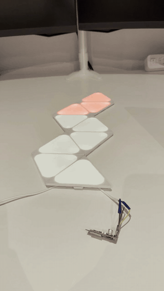

# Nanoleaf Shapes controller

An open-source replacement controller for **Nanoleaf Shapes** panels. A small interface board plugs into a
single panel edge and takes **42 V, GND and DATA** from it: no stock controller and no separate power supply.

  

<em>The rev A board (foreground) driving nine Mini Triangles through a cut flex linker. Click for the video.</em>

It runs one of four firmwares:

- **WLED**, with a native "Nanoleaf Shapes" LED output. You get effects, 2D effects laid out on the real
  panel shape, the WLED apps and Home Assistant. See [`wled/`](wled/).
- **A standalone ESP-IDF firmware** with a Wi-Fi console, status page, OTA updates and a DDP receiver. It's
  useful for bring-up, protocol work, or as a network target for another WLED instance. See [`firmware/`](firmware/).
- **Matter over Thread**, built on [esp-matter](https://github.com/espressif/esp-matter): the panels become
  one Matter colour light for Apple Home, Google Home or Home Assistant, plus a switch that runs a moving
  rainbow. It talks Thread instead of Wi-Fi and pairs over Bluetooth. See [`matter-over-thread/`](matter-over-thread/).
- **[LeafBus](https://github.com/MyrikLD/LeafBus)**, MyrikLD's original MicroPython firmware, whose protocol work
  this project builds on. The panels become a DDP and E1.31/sACN pixel sink with a layout page. It needs three
  settings on this board, and hasn't been tested on it yet; see [Running LeafBus](#running-leafbus).

> **Status:** rev A boards are built and working with an ESP32-C5 module, driving 9 Mini Triangles in chain,
> fork and ring layouts, with WLED, with the ESP-IDF firmware, and as a Matter light in a Thread network.
> Hexagons and large Triangles are handled by the code but have not been tested on real panels yet. A
> **rev B board is in development**; see [Next version](#next-version-rev-b).

## Repository

| Path | Contents |
|---|---|
| [`hardware/`](hardware/) | KiCad project (schematic and PCB), plus `Gerbers/` and the JLCPCB assembly files (`jlc_bom.csv`, `jlc_cpl.csv`) |
| [`firmware/`](firmware/) | ESP-IDF firmware |
| [`wled/`](wled/) | Patch that adds the Nanoleaf Shapes output to WLED, plus a build script |
| [`matter-over-thread/`](matter-over-thread/) | Matter-over-Thread firmware (esp-matter) |
| [`docs/protocol-notes.md`](docs/protocol-notes.md) | Panel bus behaviour measured on real panels that differs from, or adds to, the LeafBus spec |

## Hardware

**Power:** 42 V from `J1` goes to a TPS54360 buck converter (`U1`), which makes 3.31 V (`R2` 47k / `R3` 15k,
`R5` 330k for 295 kHz, `L1` 33 µH, `D1` SS210). That's plenty for an ESP32 with Wi-Fi.

**Panel bus:** this uses the same method as the stock controller: two 74LVC1G125 tri-state buffers.
- `U4` transmits. Its output is enabled only while TX is active, by a one-shot (`D2` 1N4148W, `R7` 10k,
  `C17` 220 pF, about 1.3 µs), so the line is released between bytes.
- `U3` always receives, so the controller hears its own echo (the firmware strips it).
- `R1` (2.2 kΩ) sits in series with the bus and `R6` (1 kΩ) with RX. `R10` (1 kΩ) lets a GPIO drive the
  one-shot node for optional RS485-style direction control.

**Module:** any 16 × 24 mm module with the ESP-12F footprint. The footprint is drawn for the Wireless-Tag
WT0132C6-S5 (ESP32-C6); the working boards use a DOIT ESPC5-12 (ESP32-C5). The module sits on the back, and
is hand-soldered along with `SW1`, `SW2`, `J1` and `J2`.

### Module pins

| Net | Module pin (WT0132C6-S5 numbering) | ESP32-C6 | ESP32-C5 (ESPC5-12, verified) |
|---|---|---|---|
| Bus TX | 20 | GPIO3 | GPIO26 |
| Bus RX | 19 | GPIO10 | GPIO27 |
| One-shot (RC) node | 16 | GPIO7 | GPIO6 |
| BOOT button `SW2` | 18 | GPIO9 | GPIO28 |
| UART0 RX / TX (`J2`) | 21 / 22 | GPIO17 / GPIO16 | GPIO12 / GPIO11 |

For other modules, the ESP-IDF firmware finds the bus pins itself (`pinscan`) by exercising the on-board
`U4` → `U3` loopback.

### Connectors

| Connector | Pin 1 | Pin 2 | Pin 3 |
|---|---|---|---|
| `J1`, to a panel | 42 V | GND | DATA |
| `J2`, serial | RX0 | TX0 | 3V3 |

- **`J2` has no GND pin on rev A.** For a USB-serial adapter, take GND from `J1` pin 2 or from the negative
  pad of `C11`. Cross the UART: adapter TX → `J2` pin 1, adapter RX → `J2` pin 2.
- `J2` has no DTR/RTS either, so there's no automatic reset into the bootloader. See [Flashing](#flashing).
- On rev A, the board connects through a cable made from a cut Nanoleaf flex linker (rev B will clip on
  directly). Inside the outer sheath are three wires:
  - **thick red:** 42 V → `J1` pin 1
  - **bare wire, with no insulation of its own:** GND → `J1` pin 2
  - **thin blue:** DATA (`COM` on the silkscreen) → `J1` pin 3

  Check this before connecting anything, because colours may differ between batches. The wire with continuity
  to the centre pad is GND; with the panels powered, the wire reading about 42 V is the supply. Insulate the
  stripped ends, including the bare GND wire, before powering up: 42 V on DATA destroys a panel.

### Power and safety

- **There is no reverse-polarity, fuse or TVS protection.** Reversing `J1` destroys `U1`.
- **Powered from a panel through `J1`:** the normal mode. Wi-Fi, Bluetooth and Thread all work reliably.
- **Powered from a USB-serial adapter's 3.3 V on `J2` pin 3:** good enough for flashing and for the
  radio-off console. Most adapters can't supply the current the radio draws while it starts up, though,
  so WLED and the Matter firmware reset-loop on adapter power. **Never feed adapter 3.3 V while `J1` is
  powered.**
- **Never connect TX/RX without also connecting GND.** The panel supply and a computer don't share a ground
  otherwise.

## Firmware

| | WLED ([`wled/`](wled/)) | Matter ([`matter-over-thread/`](matter-over-thread/)) | ESP-IDF firmware ([`firmware/`](firmware/)) |
|---|---|---|---|
| Use | Everyday lighting: effects, apps, Home Assistant | Smart-home light: Apple Home, Google Home, Home Assistant | Bring-up, diagnostics, protocol exploration |
| Network | Wi-Fi | Thread (needs a Thread border router); pairing over Bluetooth | Wi-Fi |
| Panel colours | WLED effects, including 2D on the real layout | One colour for all panels, white temperature, brightness; a rainbow switch | Console commands, or DDP from any sender |
| Touch | Not yet wired to WLED actions | Not yet exposed | Logged; "touch light" demo |
| Updates | WLED's update page | Serial (keeps the pairing); Matter OTA is enabled but untested | HTTP OTA with rollback |
| Chips | Board builds for ESPC5-12 (C5, tested) and WT0132C6-S5 (C6, untested); also compiles for C3 and S3 | C5 (tested) and C6 (builds, untested) | Tested on C5 |

All three drive the panels the same way: they enumerate the layout at start-up, poll the panels every 50 ms,
and re-enumerate when panels are added or removed while running.

### Running LeafBus

[LeafBus](https://github.com/MyrikLD/LeafBus) is written for an original ESP32 wired to the panel through a
resistor. To run it on this board, change three things (this hasn't been tested on the board yet):

1. **MicroPython v1.29 or later for your module:** [ESP32_GENERIC_C5](https://micropython.org/download/ESP32_GENERIC_C5/)
   for the ESPC5-12, or [ESP32_GENERIC_C6](https://micropython.org/download/ESP32_GENERIC_C6/) for the
   WT0132C6-S5. See [Flashing](#flashing) for download mode.
2. **This board's bus pins in `config.json`:** `"uart": {"tx": 26, "rx": 27}` on the ESP32-C5, or
   `{"tx": 3, "rx": 10}` on the ESP32-C6.
3. **`open_drain=False` where `app.py` creates the bus:**
   `panelbus.PanelBus(tx=cfg['uart']['tx'], rx=cfg['uart']['rx'], open_drain=False)`. This board doesn't need
   open drain, because its tri-state buffer releases the line after every byte. LeafBus's open-drain switch
   also writes a register that only exists on the original ESP32.

Then copy the files as in LeafBus's quick start. On rev A, mind the serial caveats under
[Connectors](#connectors) and [Power and safety](#power-and-safety).

## Flashing

**The first flash always goes over serial.** Connect an adapter to `J2` (see [Connectors](#connectors)),
then put the chip into download mode:

- **Hold BOOT (`SW2`, next to `J2`), tap EN (`SW1`, next to `J1`), then release BOOT.** With the ESP-IDF
  firmware installed, you can type `download` on its console instead.
- **On the ESP32-C5 the bus pins double as boot-mode straps.** UART download mode also needs GPIO27 (bus RX)
  to be high at reset. With a panel attached the bus idles high and BOOT + EN works reliably; without a
  panel it's hit-and-miss.

After that, WLED and the ESP-IDF firmware update over Wi-Fi. The Matter firmware updates over serial again
(BOOT + EN; without an erase, the pairing survives).

**Switching between firmwares:** each firmware has its own flash layout, so erase the chip when switching
(`esptool write_flash --erase-all`, or `idf.py erase-flash`). That also removes Wi-Fi settings and Matter
pairings.

## Protocol

The panel bus follows [LeafBus PROTOCOL.md](https://github.com/MyrikLD/LeafBus) (MIT): 1 Mbaud 8N1, single
wire, half duplex, with the controller initiating every exchange. Real panels differ from that document in a
few places, most importantly **the touch/status reply (`C0`) comes in layout order, not in reversed chunk
order**. Everything measured on real panels is in [`docs/protocol-notes.md`](docs/protocol-notes.md).

## Next version (rev B)

A new version of the PCB is in development. It will:

- **Fix the rev A issues** listed below.
- **Clip onto a panel like the original Nanoleaf controller.** No more cable made from a cut flex linker.

## Known issues (rev A)

| Issue | Workaround / rev B plan |
|---|---|
| `J2` has no GND pin | Take GND from `J1` pin 2 or `C11`. Rev B: 4-pin `J2` (GND, RX0, TX0, 3V3) |
| On the ESP32-C5, bus TX/RX are on boot-mode strapping pins (GPIO26/27) | Flash with a panel attached, or use `download`. Rev B: move the bus pins, or pull RX high |
| `D1` is 16 mm from `U1`, which enlarges the switching loop | Works as built. Rev B: place it next to `U1` |
| No input protection | Mind the polarity. Protection was left out on purpose |
| No bus pull-up | Not needed with Shapes panels (the panel holds DATA high). Fallback: 10 kΩ from `J1` pin 3 to 3.3 V |
| ESP32-C6 only: GPIO8 (a boot-mode strap that must be high for download mode) is left unconnected | Untested; may need a 10 kΩ pull-up to 3.3 V. Rev B: pull it up on the board |

## Credits

- [LeafBus](https://github.com/MyrikLD/LeafBus) by MyrikLD: the panel protocol specification, the geometry, and the
  original MicroPython firmware (MIT).
- **Christian Panton:** this board's PCB schematic is based on his write-up and schematics in
  [Nanoleaf Shapes deepdive, part 1](https://christian.panton.org/posts/nanoleaf-ctrl-pt1/), including the
  tri-state buffer interface the stock controller uses.
- [WLED](https://github.com/wled/WLED).
- [esp-matter](https://github.com/espressif/esp-matter) by Espressif (Apache-2.0), on top of the
  [Matter SDK](https://github.com/project-chip/connectedhomeip). The Matter firmware started from its light
  example (public domain / CC0).

## License

Hardware, the ESP-IDF firmware and the Matter firmware: [GPL-3.0](LICENSE). The files in [`wled/`](wled/)
modify WLED, which is licensed under EUPL-1.2, and are provided under WLED's licence.
